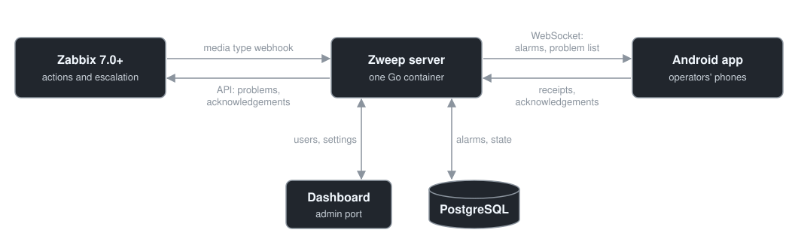

<p align="center"></p>

---

<br>

<p align="center">
  <a href="LICENSE"></a>
  
  
  
</p>

Zweep is a **Zabbix media type with its own server and Android app**. Zabbix sends alarms to the
Zweep media type as it does with e-mail or SMS; the media type hands them to your self-hosted Zweep
server, which delivers them to the Zweep app on the operators' phones: a notification with the sound of
its severity, the open problems of the operator's perimeter, and acknowledgements from the phone,
recorded in Zabbix.

You use it like any other media type: alone, together with e-mail, or as one step of an escalation in
Zabbix Actions. Who is notified, and when, stays in Zabbix.

**Delivery you can rely on.** Zweep answers the media type only after the alarm is stored, the phone
confirms every alarm it receives, and after a network loss it receives what it missed, once and in
order. If Zweep cannot accept an alarm, the media type fails like any other: Zabbix retries it, and an
escalation goes on with its next step.

## Why Zweep?

- **Acknowledge from the phone**: take charge of a problem with a message, recorded in Zabbix;
  as usual, acknowledging stops the escalation.
- **A quick look, not a second frontend**: the open problems of your perimeter with the Recent,
  Problems and History views, filters and search, to correlate on the fly. The full analysis stays
  in the Zabbix frontend.
- **No Zabbix or domain credentials on the phone**: operators activate the app with a QR code from
  the Zweep dashboard (or a Zweep account, separate from Zabbix and from the domain); the app never
  connects to Zabbix. In Zabbix they need a user only as the
  recipient of the media type, without frontend access.
- **On-premises, nothing in between**: the app connects only to your Zweep server, next to Zabbix:
  no cloud, no third-party push service (not even Google's).
- **Works without internet**: on the company network alone (Wi-Fi, VPN) alarms keep arriving even
  when the internet connection is down, which is often exactly when they matter. Services in the cloud
  and push notifications need the internet.
- **No costs**: no subscription, no per-message fees, no SMS gateway. Free software.
- **An app only for monitoring**: alarms do not mix with the chats of Telegram, WhatsApp or Teams,
  where they are easily muted or ignored; every severity and channel has its own sound.

| | What it gives | Limits for alerting |
|---|---|---|
| E-mail / SMS from Zabbix | built in | no problem list, no acknowledgement from the phone; SMS costs, e-mail is easy to miss |
| Telegram, WhatsApp, Teams, Slack | quick to set up | alarms mixed with chats; they need the internet and leave your network through a third party; delivery is not confirmed back to Zabbix |
| Cloud incident platforms | rich on-call features | subscription, alarm data in the cloud, a second place where escalations are defined |

## How it works

<p align="center"></p>

## Features

- **Reliable delivery**: every alarm is stored, numbered and confirmed by the phone; after a network
  loss or a restart the phone receives what it missed, once, in order.
- **Problems and acknowledgements**: the problems of the operator's perimeter (sources, host
  groups, severities) with the Recent, Problems and History views of Zabbix; acknowledge with a
  message from the phone, recorded in Zabbix.
- **Several Zabbix instances** (7.0 and later) on one server; the phone never connects to Zabbix and
  holds no Zabbix credentials.
- **Channels and sounds**: one channel per severity plus custom channels (hosts, host groups, tags),
  reminders, Do Not Disturb override for the channels you choose.
- **Dashboard**: users, user groups, perimeters, phones, deliveries, alarms, test messages and
  announcements, audit log, backups, HTTPS. Roles admin and manager, optional two-step verification.
- **HTTPS your way**: Let's Encrypt, company ACME CA, uploaded certificate, self-signed with key
  pinning in the activation QR code, or behind your reverse proxy.
- **App updates from your server**: the signed APK is in the image; phones are offered new versions.
- **Small and hardened**: one Go binary in a distroless container, non-root, read-only; PostgreSQL is
  the only dependency. Metrics for Prometheus and Zabbix, encrypted daily backups, SBOM.
- English and Italian.

## Production deployment

Requirements: Docker with Compose on Linux, a Zabbix 7.0+ server that can reach Zweep, Android 10+
phones, a DNS name for Zweep (needed for a trusted certificate).

```bash
git clone https://github.com/N1k0droid/zweep.git && cd zweep
cp .env.example .env          # set ZWEEP_SERVICE_URLS: the address phones and Zabbix use

mkdir -p secrets backups
head -c 32 /dev/urandom > secrets/master.key          # encrypts secrets at rest: keep a copy offline
openssl rand -hex 24 > secrets/postgres-password
printf 'postgres://zweep:%s@db:5432/zweep?sslmode=disable' "$(cat secrets/postgres-password)" > secrets/database-url
chmod 600 secrets/*
sudo chown 65532:65532 backups secrets/master.key secrets/database-url   # the container user

docker compose up -d
docker compose logs zweep | grep setup     # one-time setup token for the first admin
```

Then:

1. **First admin**: open `http://127.0.0.1:8081/admin/` on the Docker host (the dashboard listens
   only on the host loopback; use an SSH tunnel from your PC) and enter the setup token.
2. **HTTPS**: Dashboard → Settings → HTTPS ([manual, chapter 5](docs/manual/05-https.md)).
3. **Zabbix**: create a source, import the media type from Dashboard → Download, add an action
   with escalation ([chapter 6](docs/manual/06-zabbix.md)).
4. **Phones**: create the operators, scan the download QR code to install the app, then the
   activation QR code ([chapters 7](docs/manual/07-users.md) and [8](docs/manual/08-app.md)).

Images: `ghcr.io/n1k0droid/zweep` and the mirror `docker.io/n1k0droid/zweep` (linux/amd64,
linux/arm64). The signed APK is also attached to every [release](https://github.com/N1k0droid/zweep/releases).

### Network

| From → to | Port | What for |
|---|---|---|
| Zabbix server → Zweep | public port (`ZWEEP_PUBLIC_PORT`, 8080 or 443) | media type webhook |
| Phones → Zweep | public port | alarms (WebSocket), app API, app download |
| Zweep → Zabbix frontend | 80 / 443 | problem list and acknowledgements (Zabbix API) |
| Your PC → Docker host | SSH, then `127.0.0.1:8081` | dashboard (never published) |
| Zweep → Internet (optional) | 443 | Let's Encrypt or your ACME CA; DNS provider API for DNS-01 |
| Internet → Zweep (optional) | 80 | Let's Encrypt HTTP-01 challenge only |

Phones accept a certificate from a public or company CA, or a self-signed one whose key is pinned in
the activation QR code; plain HTTP is for labs only ([chapter 5](docs/manual/05-https.md)).

### Upgrading

```bash
docker compose exec -T zweep zweep-server backup -out - > zweep-$(date +%F).zwbk   # or use the daily backup in ./backups
docker compose pull
docker compose up -d
```

Set the new version in `ZWEEP_IMAGE` (`.env`) first. The database is migrated at start; downgrades
are not supported: restore the backup instead ([chapter 10](docs/manual/10-operations.md)). Phones are
offered the new app by your server.

## Local evaluation

To try Zweep on a PC with Docker Desktop (Windows, macOS or Linux) before a real deployment:

1. Do the same steps as above, with these differences in `.env`:
   `ZWEEP_SERVICE_URLS=http://<IP of the PC on your network>:8080` and `ZWEEP_IMAGE` as published.
   The `chown` is not needed with Docker Desktop.
2. Open `http://127.0.0.1:8081/admin/`, create the admin, then an operator and its activation QR code.
3. Install the app from **Dashboard → Download** (QR code), scan the activation QR code: the app warns
   that the connection is not encrypted (plain HTTP is accepted only after your confirmation).
4. Send alarms from **Dashboard → Test**, without Zabbix; connect a Zabbix test instance when ready.

Do not use this setup for real alarms: no HTTPS, and the PC must stay on.

## Documentation

The **[manual](docs/manual/README.md)** covers installation, configuration, HTTPS, Zabbix, users and
channels, the app, the dashboard, operations, troubleshooting and the reference (command line,
admin API, webhook, metrics). Security and regulatory mapping (NIS2, ISO/IEC 27001, CRA, AI Act):
[docs/COMPLIANCE.md](docs/COMPLIANCE.md). Changes: [CHANGELOG.md](CHANGELOG.md).

## Building from source

```bash
make build      # server binary in dist/
make docker     # container image (put the signed APK in apk/ first)
make check      # gofmt, vet, race tests, govulncheck, gosec
make sbom       # CycloneDX SBOM in dist/
```

Database tests need `ZWEEP_TEST_DATABASE_URL` (a PostgreSQL where the tests may create schemas).
The Android app is in [android/](android): see [android/signing/README.md](android/signing/README.md)
for release builds. An app signed with another key cannot update the official one.

| Path | Content |
|---|---|
| `cmd/zweep-server` | command line: serve, healthcheck, admin |
| `internal/` | server: API, dashboard, delivery, store (PostgreSQL), Zabbix API, HTTPS, backups |
| `zabbix/` | Zabbix media type (script and importable YAML) |
| `android/` | Android app (Kotlin, Jetpack Compose) |
| `docs/` | manual and compliance |

## Security

Please report vulnerabilities privately: see [SECURITY.md](SECURITY.md).

## Author and license

Zweep is designed and developed by **[N1k0droid](https://github.com/N1k0droid)**.
If Zweep is useful to you, a ⭐ on this repository and a follow help the project grow.

Developed with the help of an AI coding assistant: see [docs/COMPLIANCE.md](docs/COMPLIANCE.md).

Zweep is free software under the **GNU Affero General Public License v3.0 only** ([LICENSE](LICENSE),
SPDX `AGPL-3.0-only`). If you run a modified Zweep for users over a network, you must offer them the
source code of your version (AGPL §13). Third-party components and their licenses:
[THIRD_PARTY_NOTICES.md](THIRD_PARTY_NOTICES.md).

Zweep is a client *for* Zabbix; it is not affiliated with or endorsed by Zabbix LLC. Zabbix is a
trademark of Zabbix LLC.
