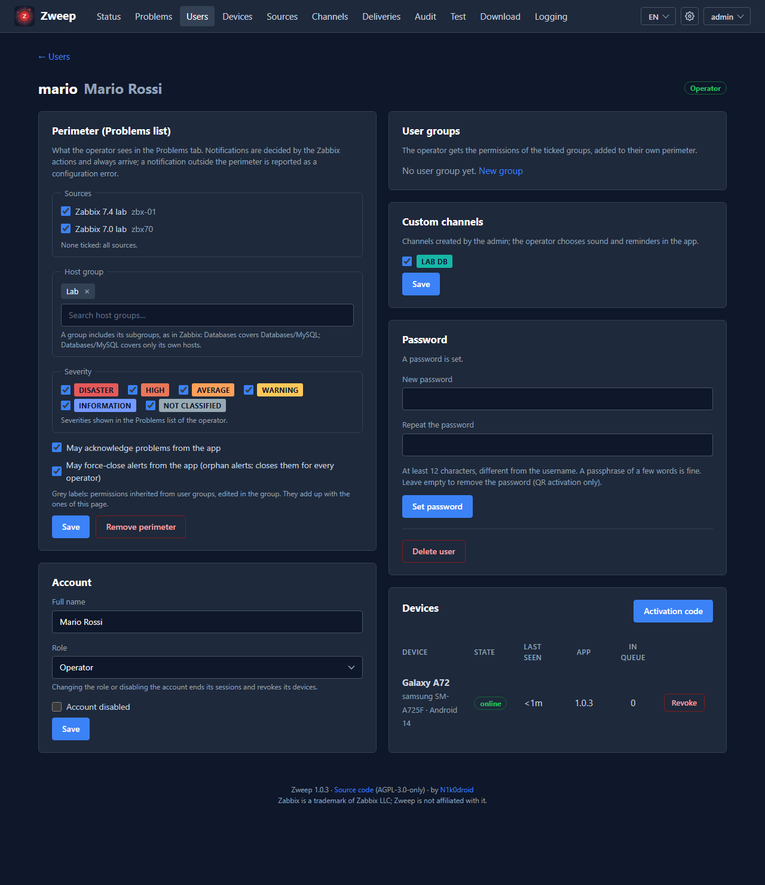

# 7. Users, groups, permissions and channels

## 7.1 Roles

| Role | Signs in to | Can |
|---|---|---|
| **admin** | dashboard, admin API | everything: accounts, sources, channels, user groups, HTTPS, settings, backups, logs |
| **manager** | dashboard | assign perimeters, user groups and custom channels to operators; create and edit user groups; assign operators to custom channels; send test messages and announcements; force-close alerts; read every page (except Logging). Cannot create, change or delete accounts, sources or channels, activate or revoke devices, nor change settings, HTTPS or backups. |
| **operator** | the app only | receive alarms; see problems in their perimeter; acknowledge and force-close if allowed |

Admins and managers **do not receive alarms**: a person who is both an administrator and on call has two
accounts (e.g. `admin.rossi` for the dashboard and `mario.rossi` for the app). This keeps the powerful
account off the phone.

The **superadmin** is the first admin created: only this account can reset the two-step verification of the
others, and it cannot be deleted, disabled or demoted (chapter 3.5). An admin can enable two-step
verification only while another active admin exists.

Removing an admin (delete, disable, or change of role) when only **one** active admin would remain, and
that admin uses two-step verification, needs three confirmations: the browser dialog, then a warning page
where you tick *I understand the risk* and type the username of the remaining admin. The audit trail
records it (`admin.user.risk_accepted`).

💡 Suggested: two admins (so one can recover the other), managers for team leads, operators for
everyone on call, and a separate admin account without two-step verification for automation (chapter 9.3).

## 7.2 Creating an operator

**Users → New user**:

| Field | Notes |
|---|---|
| Username | letters, digits and `. _ @ -`. For operators it must match **Send to** of the Zweep media in Zabbix. |
| Full name | shown in the dashboard |
| Role | operator |
| Password | **optional** for operators. Without a password the app can only be activated with a QR code or an activation code given by an admin or manager (suggested). With a password the operator can add the server in the app by himself. |

On the user page you can then:

- set the **perimeter** (7.3) and the **user groups** (7.4);
- give **custom channels** (7.5);
- create an **activation code / QR code** (7.6, admins);
- see and revoke the **devices** (admins);
- disable the account (ends sessions and revokes all devices) or delete it (devices, messages and
  deliveries are deleted; the audit trail stays).

## 7.3 Perimeter: what the operator sees in Problems

The perimeter decides what an operator sees in the **Problems** tab, and whether they can act on it.
It does **not** decide which notifications they receive: that is the job of the Zabbix actions, and
whatever Zabbix sends is always delivered.

| Element | Meaning |
|---|---|
| Sources | which Zabbix instances. None ticked: all sources. |
| Host groups | which host groups. A group includes its subgroups, as in Zabbix: `Databases` covers `Databases/MySQL`; `Databases/MySQL` covers only its own hosts. |
| Severities | which severities are shown |
| May acknowledge problems from the app | needs a source in *read and acknowledge* mode |
| May force-close alerts from the app | closes an alert for **every** operator who received it (7.8) |

Without a perimeter (and without user groups) the Problems tab is empty.

⚠ If Zabbix sends an operator a notification **outside** their perimeter, it is delivered anyway (never
drop an alarm), but Zweep counts it as a configuration mismatch (`zweep_webhook_outside_filter_total`,
warning in the audit). Usually it means the action in Zabbix and the perimeter in Zweep disagree.

## 7.4 User groups

With many operators, give permissions to **groups** instead of one by one. **User groups → New group**
(admins and managers):

- name and description;
- **members** (operators only);
- **permissions**: sources, host groups, severities, *acknowledge*, *close*;
- **custom channels** given to the members.

The rule is **additive**: an operator gets their own perimeter **plus** the permissions of every group they
belong to. A group never takes anything away. In the operator page, permissions coming from groups are
shown as grey, non-editable labels with the group name ("from: DB team"), so it is easy to see where
each right comes from.

### Example

| Group | Host groups | Severities | Acknowledge | Close | Channels |
|---|---|---|---|---|---|
| `NOC` | all | all | ✓ | ✓ | — |
| `DB team` | `Databases` | Warning and above | ✓ | — | `Database` |
| `Network` | `Network`, `Firewalls` | Average and above | ✓ | — | `Network` |
| `Customer A` | `Customers/A` | High and above | — | — | — |

`mario.rossi` in `DB team` and `Network` sees databases (Warning+), network and firewalls (Average+),
can acknowledge, cannot close, and has the channels *Database* and *Network*.

💡 Keep the operator's own perimeter empty and use only groups: then removing someone from a group really
removes those rights. Use the personal perimeter only for exceptions.

## 7.5 Channels

### Severity channels

Six fixed channels, one per Zabbix severity, for every operator. **Channels → Severity channels**: an
admin can disable one (the alarms are still received and stored, but not notified). On the phone, every
operator chooses the sound and the reminders of each channel (chapter 8.6).

### Custom channels

A custom channel takes the matching alarms **instead of** their severity channel, with its own name,
color, sound and reminders on the phone. Typical uses: a team channel ("Database"), a customer channel,
a "Backup jobs" channel with a quiet sound.

**Channels → New channel** (admin):

| Field | Example | Notes |
|---|---|---|
| Identifier | `db` | becomes `c_db`; lowercase letters, digits, `_ -` |
| Name | `Database` | shown in the app |
| Color | blue | badge color in the app |
| Rule — Sources | `zbx-prod` | none ticked: any |
| Rule — Host groups | `Databases` | subgroups included |
| Rule — Host names | `db-*` `pg??-prod` | one per line, `*` and `?` allowed |
| Rule — Tags | `service=postgres` `team~db` `backup` | `tag=value` equals, `tag~text` contains, `tag` exists |
| Rule — Minimum severity | Warning | |
| Priority | `10` | lower first when several channels match |
| Assigned operators | — | **only these operators** (plus those of the groups that give the channel) get alarms in this channel; the others keep getting them in the severity channel |

Every filled condition must match; values within one list are alternatives. Example: Sources
`zbx-prod`, Host names `db-*`, Tags `service=postgres` → alarms from `zbx-prod` about hosts starting with
`db-` **and** tagged `service=postgres`.

The app shows the channel name and color, and the severity when the event has one. If several channels
match, the lowest priority wins (counted in `zweep_channel_overlap_total`: consider making the rules
exclusive).

## 7.6 Activating the app (enrollment)

Three ways, from the most to the least suggested:

| Way | Who starts it | What the operator does | Needs |
|---|---|---|---|
| **QR code** | admin: **Users → operator → Activation code** | scans the QR code with the phone camera (or Google Lens): Zweep opens with everything filled in, and the operator confirms | `ZWEEP_SERVICE_URLS` set |
| **Activation code** | admin, same button | in the app: **Settings → + Add server → Activation code**: server URL and code | — |
| **Username and password** | the operator | **+ Add server → Username and password** | a password set for the operator |

The activation code is **single use, valid 15 minutes**, and shown only once. The QR code is a `zweep://enroll?…` link with the
server URL, the code and, when needed, the **key fingerprint** of the certificate
(chapter 5.9) — so with a self-signed or company certificate the QR code is the simplest way.

Tips:

- show the QR code on the screen of the admin's PC and let the operator scan it: nothing to type;
- for a remote operator, send the code by one channel (e.g. phone call) and the server URL by another;
- a phone can be connected to up to 5 Zweep servers (e.g. production and a customer's server).

## 7.7 Devices

**Devices** lists every phone, with its state:

| State | Meaning |
|---|---|
| online | connected now |
| offline | not connected, last contact recent |
| unreachable | no contact for longer than `heartbeat.threshold` (15 min) — the operator may not receive alarms |
| never connected | activated but never connected |
| logged out | the operator logged out from the app |
| revoked | access removed by an admin or manager |

**Revoke** (admins) signs the app out of this server at once (if online) or at the next connection. The phone
shows *Access revoked: <server>* and tells the operator to log out of that server in **Settings →
Servers** to reconfigure the app. Revoke a device when a phone is lost, changed or given to someone
else.

## 7.8 Orphan alerts and forced close

An alert stays **open** on the phones until Zabbix sends its recovery. Sometimes the recovery never
comes: the trigger was deleted, the host removed, the action changed, a maintenance... These are
**orphan alerts**.

- **Automatically**: if the source has the Zabbix API and `orphans.autoclose` is on (default), an
  alert whose problem is no longer open in Zabbix for `orphans.after` (default 1 hour) is closed for
  everyone. The app shows *Closed automatically: no longer open in Zabbix*.
- **From the dashboard**: **Problems → Open alerts in Zweep** lists the alerts still open on the phones,
  with the state in Zabbix (Open, Resolved, Not found, Unknown) and an *Orphan* mark. **Force close**
  closes it for every operator (admins and managers).
- **From the app**: operators with *May force-close alerts* see **Force close** in the alert detail. The
  app warns if Zabbix still shows the problem as open.

Forced close never changes Zabbix and is recorded in the audit trail with the author. Zabbix keeps the last
word: an update of the same problem newer than the close (an acknowledge, a comment, a severity change)
opens the alert again for whom receives it, and is notified; an older update arriving late does not; the
recovery of Zabbix closes it for good.

## 7.9 Test messages and announcements

**Test** page (admins and managers):

| Type | Behaviour |
|---|---|
| **Test** | a message archived once read: to check that a phone receives and rings |
| **Problem** | an **announcement** that stays active on the phones until you send its **Resolved** from the list *Open announcements* — e.g. "Planned maintenance of the core switch 22:00–23:00" |

Recipients: one operator, the operators of a custom channel, or all operators. You choose how the phones
show it: in a severity channel, or in a custom channel (badge and color). Test messages and
announcements go through the same delivery path as real alarms, so they are a real end-to-end test.

The operator can also send himself a test alarm from the app: **Settings → server → Send test alarm**.
